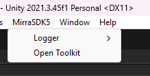
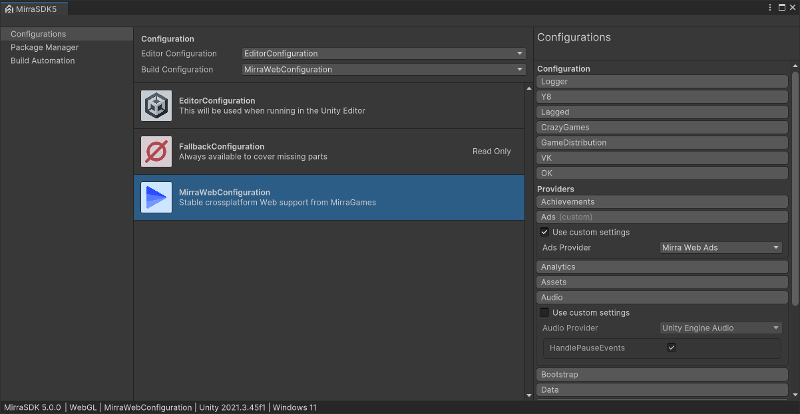
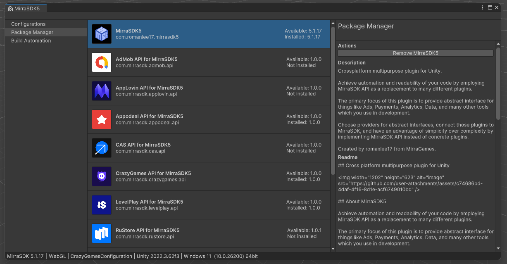

# Установка и настройка

Перед установкой обязательно убедитесь, что в проекте нет никаких ошибок компиляции в консоли, иначе вы не сможете увидеть добавленный пакет пока существующие ошибки в проекте не будут устранены.

Также обязательно убедитесь, что в проекте нет других версий MirraSDK, потому что они будут конфликтовать между собой. Допускается добавить пакет MirraSDK5 рядом с предыдущими версиями, чтобы произвести смену кода в проекте, но пока в проекте установлено несколько версий, работать ничего не будет.

Если после сборки проекта с MirraSDK5 на WebGL у вас имеются критические ошибки вида "SDK is initialized multiple times" или "SDK instance already exists" убедитесь, что у вас нет конфликтующего WebGL-нативного кода вроде .jslib или .jspre библиотек от других плагинов, которые напрямую взаимодействуют с API WebGL площадок.

Чтобы добавить пакет в проект, откройте Unity Package Manager и добавьте пакет при помощи `Add package from git URL...`, используя официальный .git адрес репозитория MirraSDK5:

```git
https://github.com/MirraSDK/SDK5.git
```

После того, как компилятор обработает новый пакет и Unity не будет показывать обработку нового кода и файлов в проекте, откройте MirraSDK Toolkit при помощи контекстного меню окна Unity.



MirraSDK Toolkit необходим чтобы настраивать поведение MirraSDK для специфических конфигураций, например, существует конфигурация MirraWebConfiguration - она отвечает за поведение MirraSDK на WebGL. Модули, которые выбраны в этой конфигурации будут использоваться при запуске сборки на WebGL если вы выбрали эту конфигурацию в выпадающем списке конфигураций Build Configuration.



Обратите внимание, что конфигурации доступные вам в MirraSDK Toolkit будут появляться или пропадать в зависимости от того, какую платформу вы выбрали в Build Settings. Например, на Windows или Android проекте не будет доступен MirraWebConfiguration, а на WebGL не будет доступен GooglePlayConfiguration. Обязательно смотрите какую платформу вы выбрали в Build Settings если что-то отсутствует, т.к. MirraSDK Toolkit меняется в зависимости от выбранной платформы для билда.

Вы также можете выбрать конфигурацию, которая будет выполняться в редакторе при запуске Play Mode, но учтите, что вы не сможете вызывать нативный код из редактора, поэтому конфигурации, которые обращаются к нативному коду через плагины (например, MirraWebConfiguration) будут запускаться с ошибкой в редакторе. Рекомендуется использовать EditorConfiguration для редактора как она и выбрана по умолчанию, либо FallbackConfiguration чтобы полностью отключить весь функционал MirraSDK5, т.к. FallbackConfiguration отвечает за пустые модули, или по другому, заглушки - ничего не делает, существует как заглушка в случае если никаких других модулей недоступно для использования.

Перед тем, как использовать MirraSDK API в вашем коде проекта, обязательно сделайте ожидание готовности MirraSDK перед тем как к нему обращаться через код. Любое обращение к MirraSDK API до готовности (инициализации) будет с исключением либо критической ошибкой, что черевато вылетом. Рекомендуется создать пустую сцену и назначить ее самой первой в Build Settings, в ней внедрить ожидание инициализации MirraSDK (<https://romanlee17.com/ru/unity/mirrasdk/initialization>), а после этого только запускать следующую сцену, где уже можно обращаться к MirraSDK API сколько угодно и когда угодно без ограничений.



В MirraSDK5 Toolkit также есть Package Manager - через него вы можете отслеживать актуальность установленных модулей, обновить их, а также посмотреть инструкции по установке и настройке, и любые особенности при работе с расширением для MirraSDK5.

Изучить MirraSDK API можно в разделах документации ниже:

Достижения: <https://romanlee17.com/ru/unity/mirrasdk/achievements>

Рекламная монетизация: <https://romanlee17.com/ru/unity/mirrasdk/ads>

Сбор аналитики: <https://romanlee17.com/ru/unity/mirrasdk/analytics>

Подгрузка файлов: <https://romanlee17.com/ru/unity/mirrasdk/assets>

Настройки звука: <https://romanlee17.com/ru/unity/mirrasdk/audio>

Бутстрап: <https://romanlee17.com/ru/unity/mirrasdk/bootstrap>

Сохранение прогресса: <https://romanlee17.com/ru/unity/mirrasdk/data>

Устройство: <https://romanlee17.com/ru/unity/mirrasdk/device>

Эксперименты: <https://romanlee17.com/ru/unity/mirrasdk/flags>

Инициализация: <https://romanlee17.com/ru/unity/mirrasdk/initialization>

Локализация: <https://romanlee17.com/ru/unity/mirrasdk/language>

Внутриигровые покупки: <https://romanlee17.com/ru/unity/mirrasdk/payments>

Площадка: <https://romanlee17.com/ru/unity/mirrasdk/platform>

Игрок: <https://romanlee17.com/ru/unity/mirrasdk/player>

Время: <https://romanlee17.com/ru/unity/mirrasdk/time>